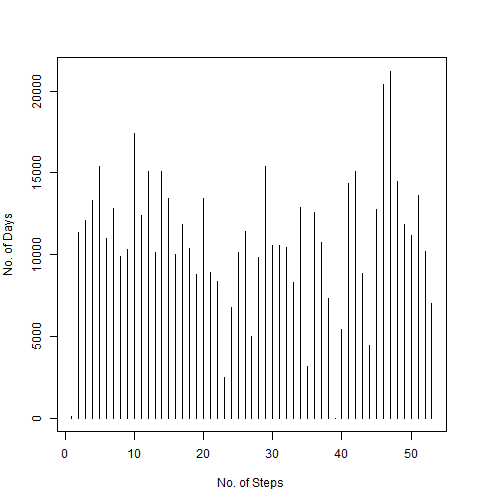
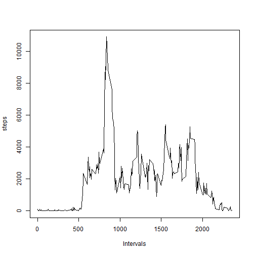
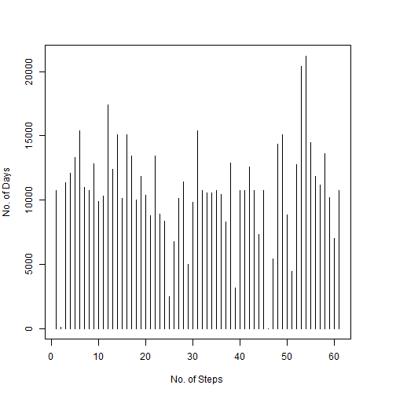
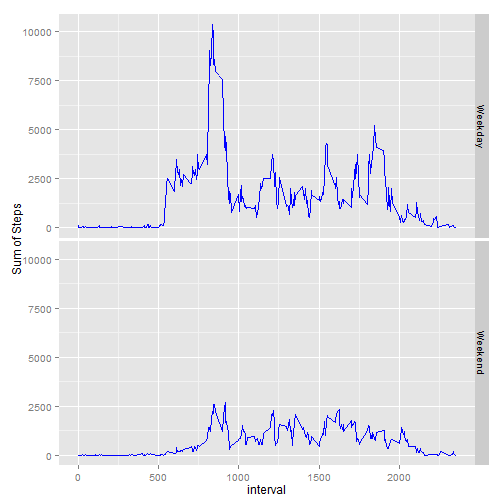

# Reproducable Research: Peer Assignment 1


## Loading and preprocessing data

The code below reads the data from activity.csv stored in the working directory. A second variable is created which excludes incomplete cases

```r
mydata<- read.csv("C:/Users/Sumit/Documents/R/MyStuff/activity.csv")
mydata2<-mydata[complete.cases(mydata),]
```

## What is mean total number of steps taken per day?
In order to create histogram of the total number of steps taken each day, we will need to create a data table with total number of steps taken each day.


```r
library(dplyr)
sumofsteps<- summarise(group_by(mydata2,date),sum(steps))
steps<- unlist(sumofsteps[2])
```

The histogram of the total number of steps taken each day


```r
par(mar=c(5,4,4,4))
plot(steps,type="h",xlab="No. of Steps", 
          ylab="No. of Days")
```

 

Mean and median of the number of steps


```r
my_mean<- mean(steps,na.rm=T)
my_med<- median(steps,na.rm=T)
```
The mean of number of steps is 10766.19 and the median is 10765


##What is the average daily activity pattern?

The daily activity pattern in interval of five minutes is shown in the chart below


```r
sumofsteps2<- summarise(group_by(mydata2,interval),sum(steps))
steps<- unlist(sumofsteps2[2])
plot(sumofsteps2$interval,steps,type="l", xlab="Intervals")
```

 


```r
max_int<- sumofsteps2[sumofsteps2[2]==max(sumofsteps2[2]),1]
```
The 5 min interval with has maximum number of steps on average is 835

## Imputing missing values


```r
missing<- length(which(!complete.cases(mydata)))
```
There are 2304 rows with missing value

We will replace NA with mean value for that 5 minute interval


```r
for (i in 1:nrow(mydata)){
    if (is.na(mydata[i,1])) {
        mydata[i,1]<- mean(mydata[1][mydata$interval==mydata[i,3],],na.rm=T)
    }
}
```

In order to create histogram of the total number of steps taken each day with the new data set, we will need to create a data table with total number of steps taken each day.


```r
library(dplyr)
sumofsteps<- summarise(group_by(mydata,date),sum(steps))
steps2<- unlist(sumofsteps[2])
```

The histogram of the total number of steps taken each day


```r
par(mar=c(5,4,4,4))
plot(steps2,type="h",xlab="No. of Steps", 
          ylab="No. of Days")
```

 

Mean and median of the number of steps


```r
my_mean<- mean(steps2)
my_med<- median(steps2)
```
The mean of number of steps is 10766.19 and the median is 10766.19. The mean remains the same as one for the dataset with NAs but median changes slightly. 

##Are there differences in activity patterns between weekdays and weekends?

To check the differences in activity patterns between weekdays and weekends, we would need to create a new factor in the data set with two levels-Weekend and Weekday


```r
library(lubridate)

for (i in 1:nrow(mydata)){
    dow<- weekdays(ymd(mydata[i,2]))
    
    if (dow %in% c("Saturday","Sunday")){
        mydata[i,"dow"]<- "Weekend"
    } 
    else {
        mydata[i,"dow"]<-"Weekday"
    }
}
```
In order to compare the activity on weekend and weekdays, a panel plot is created with  containing a time series plot of the 5-minute interval and the average number of steps taken, averaged across all weekday days or weekend days 


```r
library(ggplot2)
ggplot(mydata, aes(interval, steps))+
    stat_summary(fun.y=sum,geom="line",colour="blue")+
    facet_grid(dow~.)+scale_y_continuous(name="Sum of Steps")
```

 
